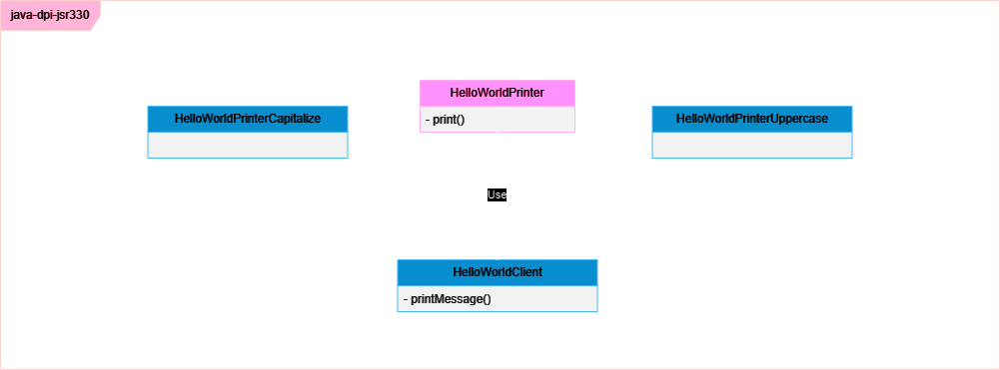

# Java Dependency Injection JSR-330

A small example of how to use dependency injection in Java using the `jakarta.inject` API and the [**Weld SE**](https://weld.cdi-spec.org/) implementation.

[**Weld SE**](https://weld.cdi-spec.org/) is an implementation of CDI (Context and Dependency Injection) in Java SE. The CDI specification is based on JSR-330 for dependency injection, which allows injecting dependencies into objects without the need to explicitly create instances in the code.

## Components

- **`HelloWorldPrinter`:** Interface that defines the `print` method to print a Hello World
- **`HelloWorldPrinterCapitalize`:** Implementation of `HelloWorldPrinter` that prints Hello World in capitalized format.
- **`HelloWorldPrinterUppercase`:** Implementation of `HelloWorldPrinter` that prints Hello World in uppercase format.
- **`HelloWorldClient`:** Client that injects all implementations of `HelloWorldPrinter` and calls the `print` method of each.
